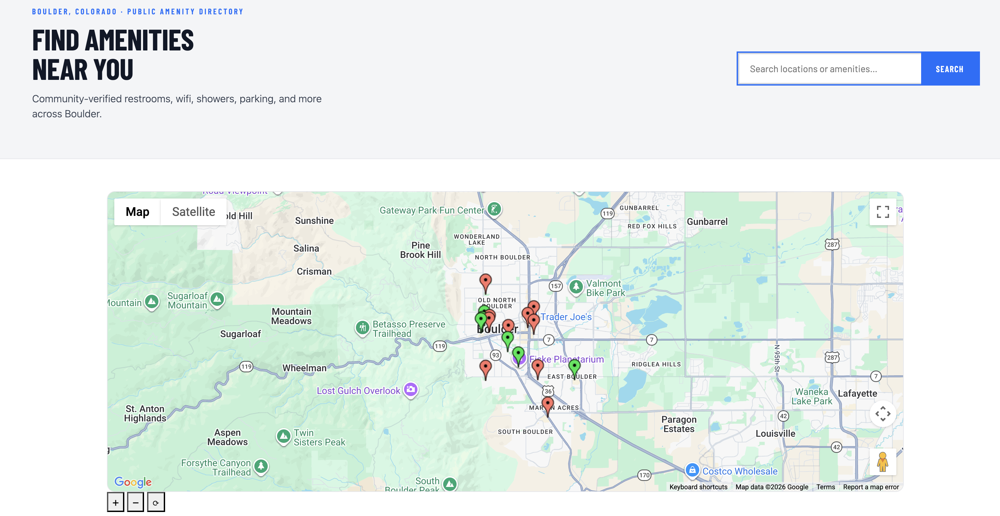

<h1 align="center">
  <a href="https://github.com/btorio15/group_project">
    <!-- Please provide path to your logo here -->
    
  </a>
</h1>

## Amenity Finder

Table of Contents

- [Application Description](#Application-Description)
- [Contributors](#Contributors)
- [Technology Stack](#Technology-Stack)
- [Prerequisites](#prerequisites)
- [Instructions](#instructions)
- [Tests](#tests)
- [Deployed Application](#Deployed-Application)

---

## Application Description

The application shows a map with pins on locations with amenities in Boulder, CO. Users are prompted to log in or register upon accessing the application, and then they are able to see the map with default amenity locations added to it by the developers and locations added by other users. Beyond that, any user can submit a location of their own to appear on the site, with information about the type of amenity, location, and image. Users can update the information listed on locations that others have posted or that comes default when initializing the application.
The map is be pulled from Google Maps API to load the map of Boulder and the pins are placed over the map for users to see.

## Contributors

Developed by Lucas Velyvis, Benjamin Torio, Wylie Knapek, and John Bass.

## Technology Stack

Postgres and PostGIS were used to store data and geographical data. The database was originally made in SQL and initialized upon docker creation. Now, the database is done by Supabase via remote hosting, to ensure data is preserved when the application is closed/opened. The UI was created with Handlebars and CSS, utilizing pages and partials to create a constistently styled interface. Javascript was used to connect to the db, configure application settings, implement API routes, start the server, and run automated tests. Google Maps external API was used to render the map and location pins for the user to see. NodeJS and ExpressJS were used as a javascript runtime environment and web application framework. Docker is used for containerization and defining services. Mocha and Chai are used to run backend tests and validate outcomes.

## Prerequisites

To run the application locally, the user must download docker have access to the Google Maps API key from a developer.

To run the application on the deployed version, no prerequisites are needed.

## Instructions

To run the application locally, download docker, create a .env file, copy everything from .example.env into it, and paste the Google Maps API key into the .env file given to the user by a developer. Then run docker compose up --build in the ProjectSourceCode directory and the application will be accessible at http://localhost:3000.

To run the application on the deployed version, access it at https://group-project-l9op.onrender.com/home.

## Tests

To run the user acceptance tests, do the following:

UAT 1:

- Ensure you are a user that has not accessed the application before. This test is partially meant to ensure a new user is easily able to operate within the application. You must access the deployed application. You must log in to the admin account or your own account to test this. Go to the home page. Click the add location button below the map. Enter valid location details and press add location. Check to see if the location appears on the map. If it does, the test passed. If it does not, or you had an issue executing the test, the test failed. 

UAT 2:

- Ensure you are a user that has not accessed the application before. This test is partially meant to ensure a new user is easily able to operate within the application. You must access the deployed application. You must press the "Register here" button under the login section. You must enter valid registration credentials. Check to see if you are redirected to the login screen. If not, the test failed. If so, continue by logging in with the information you registered with. Check to see if you are redirected to the home page. If not, the test failed. If so, the test passed, unless you had an issue executing the test.

UAT 3:

- Ensure you are a user who has used the home page before and understand the location card feature. You must access the deployed application. You must log in to your personal account. If you do not have one, follow the instructions for UAT 2. Once you are logged in successfully, scroll down on the home page until you see the location cards. Click on any one, write a review and press post review. Check to see if the review is listed under "All Reviews" after you post it. If it is there, the test passed, if not, or you had an issue executing the test, the test failed.

## Deployed Application

Here is the link to access the deployed application: https://group-project-l9op.onrender.com.
